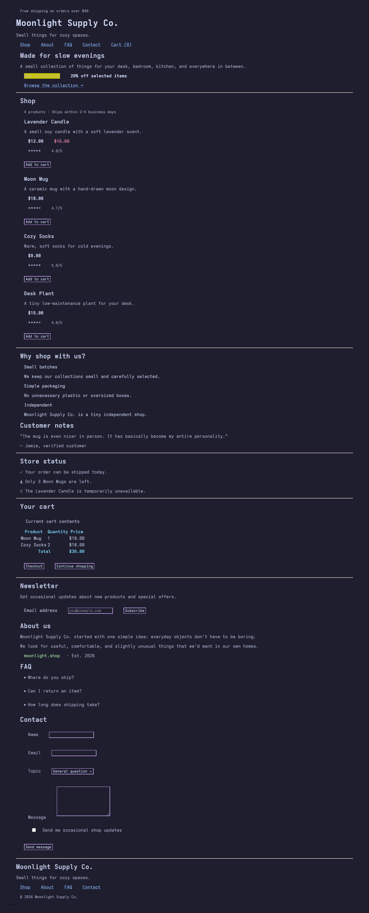

# colorscheme-webify

some small CSS files you can import to make your website catppuccin frappe themed

there are multible versions of the project, their CSS files are in `/src/chosen-colorscheme/chosen-version`

# api

there are 3 classes that you can use in your website: error, warning, success, highlight and info. they will color the text of your HTML tag

# demo

before (Catppuccin Mocha modern version):

after:

